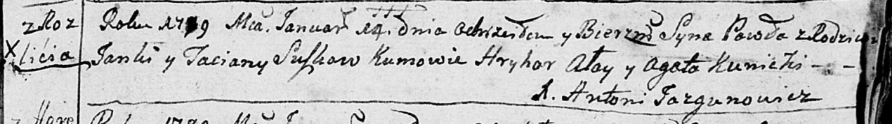
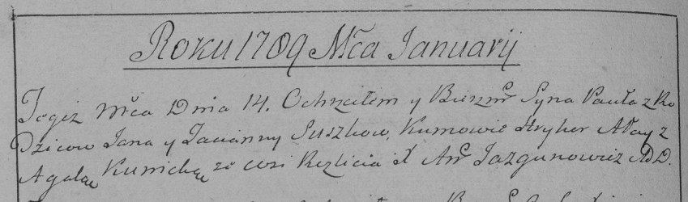

**Сушко Павел Янов (Suszko Paweł)**

14 января 1789 г -- крещение (НИАБ 136-13-894, лист 6, №2/1789-р
(ориг)), (РГИА 823-2-18, лист 237об, №1/1789-р (коп)).

**НИАБ 136-13-894:** Лист 6. **Метрическая запись №2/1789-р (ориг).**

Дедиловичская Покровская церковь. 14 января 1789 года. Метрическая
запись о крещении.

Suszko Paweł -- сын родителей с деревни Разлитье.

Suszko Janka-- отец.

Suszkowa Taciana -- мать.

Ałay Hryhor - кум.

Kunicka Agata - кума.

Jazgunowicz Antoni -- ксёндз.

**РГИА 823-2-18:** Лист 237об. **Метрическая запись №1/1789-р (коп).**

Дедиловичская Покровская церковь. 14 января 1789 года. Метрическая
запись о крещении.

Suszko Paweł -- сын родителей с деревни Разлитье.

Suszko Jan -- отец.

Suszko Tacianna -- мать.

Ałay Hryhor -- кум.

Kunicka Agata - кума.

Jazgunowicz Antoni -- ксёндз.
