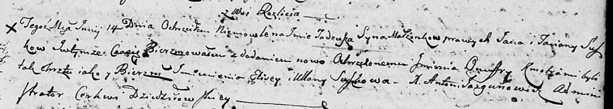

**Сушко Тадей Янов (Suszko Tadey Onufry)**

14 июня 1803 г -- крещение (НИАБ 136-13-894, лист 51, №25/1803-р
(ориг)).

**НИАБ 136-13-894:** Лист 51. **Метрическая запись №25/1803-р (ориг).**

Дедиловичская Покровская церковь. 14 июня 1803 года. Метрическая запись
о крещении.

Suszko Tadeusz Onuffry -- сын родителей с деревни Разлитье.

Suszko Jan -- отец.

Suszkowa Taciana -- мать.

J\...iewicz Elisey -- кум.

Suszkowa Ullana -- кума.

Jazgunowicz Antoni -- ксёндз.
