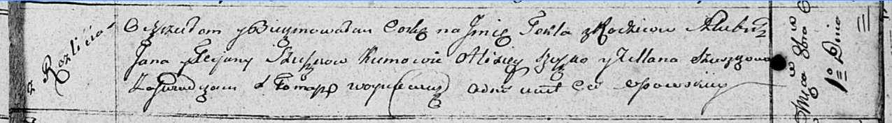

**Сушко Текля Янова (Suszkowna Tekla)**

1 октября 1810 г -- крещение (НИАБ 136-13-894, лист 79, №47/1810-р
(ориг)).

**НИАБ 136-13-894:** Лист 79. **Метрическая запись №47/1810-р (ориг).**

Осовская Покровская церковь. 1 октября 1810 года. Метрическая запись о
крещении.

Szuzkowna Tekla -- дочь родителей с деревни Разлитье.

Szuszko Jan -- отец.

Szuszkowa Tacjana -- мать.

Szuszko Alisiey -- кум.

Szuszkowa Ullana -- кума.

Woyniewicz Tomasz -- ксёндз.
