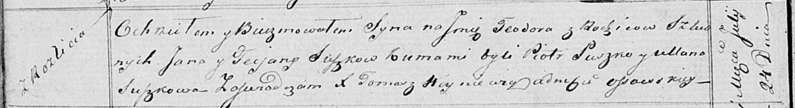

**Сушко Тодор Янов (Suszko Teodor)**

24 июля 1819 г -- крещение (НИАБ 136-13-894, лист 101об, №38/1819-р
(ориг)).

**НИАБ 136-13-894:** Лист 101об. **Метрическая запись №38/1819-р
(ориг).**

Осовская Покровская церковь. 24 июля 1819 года. Метрическая запись о
крещении.

Suszko Teodor -- сын родителей с деревни Разлитье.

Suszko Jan -- отец.

Suszkowa Taciana -- мать.

Suszko Piotr -- кум.

Suszkowa Ullana -- кума.

Woyniewicz Tomasz -- ксёндз.
