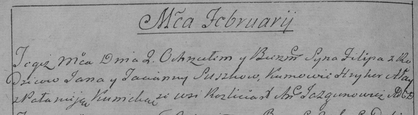

**Сушко Филип Янов (Suszko Filip)**

2 февраля 1790 г -- крещение (НИАБ 136-13-894, лист 8об, №10/1790-р
(ориг)), (РГИА 823-2-18, лист 239об, №6/1790-р (коп)).

**НИАБ 136-13-894:** Лист 8об. **Метрическая запись №10/1790-р (ориг).**

{width="6.496527777777778in"
height="0.9715627734033245in"}

Дедиловичская Покровская церковь. 2 февраля 1790 года. Метрическая
запись о крещении.

Suszko Filip -- сын родителей с деревни Разлитье.

Suszko Jan -- отец.

Suszkowa Taciana -- мать.

Ałay Hryhor - кум.

Kunicka ? - кума.

Jazgunowicz Antoni -- ксёндз.

**РГИА 823-2-18:** Лист 239об. **Метрическая запись №6/1790-р (коп).**

{width="6.496527777777778in"
height="1.79375in"}

Дедиловичская Покровская церковь. 2 февраля 1790 года. Метрическая
запись о крещении.

Suszko Filip -- сын родителей с деревни Разлитье.

Suszko Jan -- отец.

Suszko Tacianna -- мать.

Alay Hryhor -- кум.

Kunicka Pałanieja - кума.

Jazgunowicz Antoni -- ксёндз.
