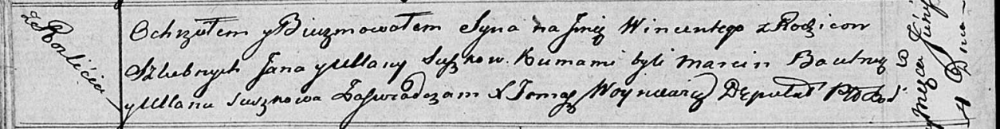

**Сушко Винценты Янов (Suszko Wincenty)**

4 июня 1816 г -- крещение (НИАБ 136-13-894, лист 93об, №15/1816-р
(ориг)).

**НИАБ 136-13-894:** Лист 93об. **Метрическая запись №15/1816-р
(ориг).**

Осовская Покровская церковь. 4 июня 1816 года. Метрическая запись о
крещении.

Suszko Wincenty -- сын родителей с деревни Разлитье.

Suszko Jan -- отец.

Suszkowa Ullana -- мать.

Bautruk Marcin -- кум.

Suszkowa Ullana -- кума.

Woyniewicz Tomasz -- ксёндз.
