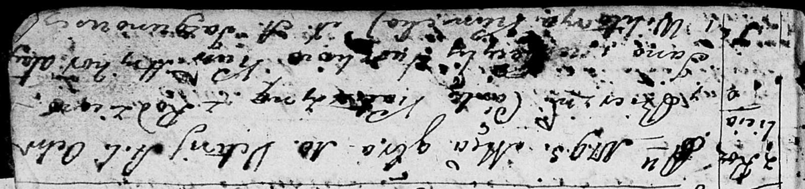

**Сушко Катерина Янкова младшая (Suszkowna Katerzyna)**

10 ноября 1795 г -- крещение (НИАБ 136-13-894, лист 26, №52/1795-р
(ориг)).

**НИАБ 136-13-894:** Лист 26. **Метрическая запись №52/1795-р (ориг).**

{width="6.496527777777778in"
height="1.530764435695538in"}

Дедиловичская Покровская церковь. 10 ноября 1795 года. Метрическая
запись о крещении.

Suszkowna Katerzyna -- дочь родителей с деревни Разлитье.

Suszko Jan -- отец.

Suszkowa Cecylija -- мать.

Ałay Hryhor - кум.

Kunicka Wiktorya - кума.

Jazgunowicz Antoni -- ксёндз.
