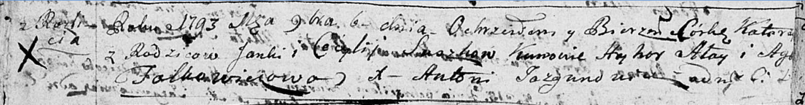
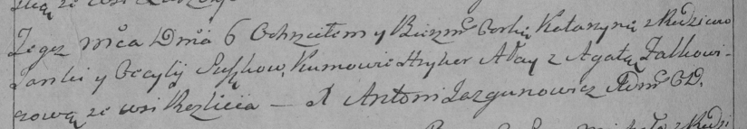

**Сушко Екатерина Янкова (Suszkowna Katerzyna)**

6 ноября 1793 г -- крещение (НИАБ 136-13-894, лист 20об, №78/1793-р
(ориг)), (РГИА 823-2-18, лист 248об, №44/1793-р (коп)).

**НИАБ 136-13-894:** Лист 20-об. **Метрическая запись №78/1793-р
(ориг).**

Дедиловичская Покровская церковь. 6 ноября 1793 года. Метрическая запись
о крещении.

Suszkowna Katerzyna -- дочь родителей с деревни Разлитье.

Suszko Janka -- отец.

Suszkowa Cecylija-- мать.

Ałay Hryhor - кум.

Falkowiczowa Agata - кума.

Jazgunowicz Antoni -- ксёндз.

**РГИА 823-2-18:** Лист 248об. **Метрическая запись №44/1793-р (коп).**

Дедиловичская Покровская церковь. 6 ноября 1793 года. Метрическая запись
о крещении.

Suszkowna Katarzyna -- дочь родителей с деревни Разлитье.

Suszko Janka -- отец.

Suszkowa Cecylija -- мать.

Ałay Hryhor -- кум.

Falkowiczowa Agata -- кума.

Jazgunowicz Antoni -- ксёндз.
