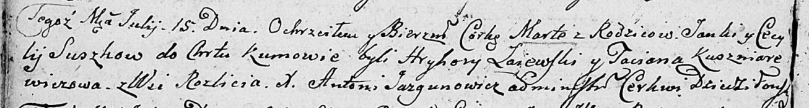

**Сушко Марта Янкова (Suszkowna Marta)**

15 июля 1806 г -- крещение (НИАБ 136-13-894, лист 60об, №30/1806-р
(ориг)).

**НИАБ 136-13-894:** Лист 60об. **Метрическая запись №30/1806-р
(ориг).**

Дедиловичская Покровская церковь. 15 июля 1806 года. Метрическая запись
о крещении.

Suszkowna Marta -- дочь родителей с деревни Разлитье.

Suszko Janka -- отец.

Suszkowa Cecylija -- мать.

Łaiewski Hryhory -- кум.

Kuszniarewiczowa Taciana -- кума.

Jazgunowicz Antoni -- ксёндз.
