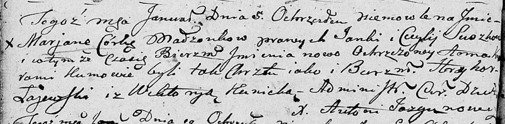

**Сушко Марьяна Янкова (Suszkowna Marjana Anna)**

5 января 1802 г -- крещение (НИАБ 136-13-894, лист 45об, №2/1802-р
(ориг)).

Лист 45об. **Метрическая запись №2/1802-р (ориг).**

{width="6.496527777777778in"
height="1.6011668853893264in"}

Дедиловичская Покровская церковь. 5 января 1802 года. Метрическая запись
о крещении.

Suszkowna Marjana Anna -- дочь родителей \[с деревни Разлитье\].

Suszko Janka -- отец.

Suszkowa Cecylija -- мать.

Łajewski Hryhor -- кум.

Kunicka Wiktoryja -- кума.

Jazgunowicz Antoni -- ксёндз.
