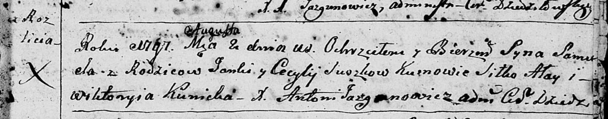

**Сушко Самуэль Янков (Suszko Samuel)**

2 августа 1797 г -- крещение (НИАБ 136-13-894, лист 34, №49/1797-р
(ориг)), (РГИА 823-2-18, лист 260об, №33/1797-р (коп)).

**НИАБ 136-13-894:** Лист 34. **Метрическая запись №49/1797-р (ориг).**

Дедиловичская Покровская церковь. 2 августа 1797 года. Метрическая
запись о крещении.

Suszko Samuel -- сын родителей с деревни Разлитье.

Suszko Janka -- отец.

Suszkowa Cecylija -- мать.

Ałay Siłko - кум.

Kunicka Wiktoryja - кума.

Jazgunowicz Antoni -- ксёндз.

**РГИА 823-2-18:** Лист 260об. **Метрическая запись №33/1797-р (коп).**

Дедиловичская Покровская церковь. 2 августа 1797 года. Метрическая
запись о крещении.

Suszko Samuś -- сын родителей с деревни Разлитье.

Suszko Janka -- отец.

Suszkowa Cecylija -- мать.

Ałay Siłka -- кум.

Kowalowa Wiktorya -- кума.

Jazgunowicz Antoni -- ксёндз.
