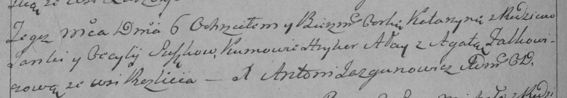

**Сушко Янка (Suszko Janka)**

10 ноября 1790 г -- венчание с Цецылией Лапец (НИАБ 136-13-894, лист 69,
№19/1790-б (ориг)).

6 ноября 1793 г -- крещение дочери Катерыны (НИАБ 136-13-894, лист 20об,
№78/1793-р (ориг)), (РГИА 823-2-18, лист 248об, №44/1793-р (коп)).

10 ноября 1795 г -- крещение дочери Катерыны младшей (НИАБ 136-13-894,
лист 26, №52/1795-р (ориг)).

2 августа 1797 г -- крещение сына Самуэля (НИАБ 136-13-894, лист 34,
№49/1797-р (ориг)), (РГИА 823-2-18, лист 260об, №33/1797-р (коп)).

5 января 1802 г -- крещение дочери Марьяны Анны (НИАБ 136-13-894, лист
45об, №2/1802-р (ориг)).

15 июля 1806 г -- крещение дочери Марты (НИАБ 136-13-894, лист 60об,
№30/1806-р (ориг)).

**НИАБ 136-13-894:** Лист 69. **Метрическая запись №19/1790-б (ориг).**

{width="6.496527777777778in"
height="1.014475065616798in"}

Дедиловичская Покровская церковь. 10 ноября 1790 года. Метрическая
запись о венчании.

Suszko Jan -- жених, с деревни Разлитье.

Łapciowa Cecylia -- невеста.

Suszko Łukjan -- свидетель.

Suszko Piatruś -- свидетель.

Jazgunowicz Antoni -- ксёндз.

**НИАБ 136-13-894:** Лист 20-об. **Метрическая запись №78/1793-р
(ориг).**

{width="6.496527777777778in"
height="0.8515419947506562in"}

Дедиловичская Покровская церковь. 6 ноября 1793 года. Метрическая запись
о крещении.

Suszkowna Katerzyna -- дочь родителей с деревни Разлитье.

Suszko Janka -- отец.

Suszkowa Cecylija-- мать.

Ałay Hryhor - кум.

Falkowiczowa Agata - кума.

Jazgunowicz Antoni -- ксёндз.

**РГИА 823-2-18:** Лист 248об. **Метрическая запись №44/1793-р (коп).**

{width="6.496527777777778in"
height="1.1277777777777778in"}

Дедиловичская Покровская церковь. 6 ноября 1793 года. Метрическая запись
о крещении.

Suszkowna Katarzyna -- дочь родителей с деревни Разлитье.

Suszko Janka -- отец.

Suszkowa Cecylija -- мать.

Ałay Hryhor -- кум.

Falkowiczowa Agata -- кума.

Jazgunowicz Antoni -- ксёндз.

**НИАБ 136-13-894:** Лист 26. **Метрическая запись №52/1795-р (ориг).**

{width="6.496527777777778in"
height="1.530764435695538in"}

Дедиловичская Покровская церковь. 10 ноября 1795 года. Метрическая
запись о крещении.

Suszkowna Katerzyna -- дочь родителей с деревни Разлитье.

Suszko Jan -- отец.

Suszkowa Cecylija -- мать.

Ałay Hryhor - кум.

Kunicka Wiktorya - кума.

Jazgunowicz Antoni -- ксёндз.

**НИАБ 136-13-894:** Лист 34. **Метрическая запись №49/1797-р (ориг).**

{width="6.496527777777778in"
height="1.2820067804024498in"}

Дедиловичская Покровская церковь. 2 августа 1797 года. Метрическая
запись о крещении.

Suszko Samuel -- сын родителей с деревни Разлитье.

Suszko Janka -- отец.

Suszkowa Cecylija -- мать.

Ałay Siłko - кум.

Kunicka Wiktoryja - кума.

Jazgunowicz Antoni -- ксёндз.

**РГИА 823-2-18:** Лист 260об. **Метрическая запись №33/1797-р (коп).**

{width="6.496527777777778in"
height="1.9027777777777777in"}

Дедиловичская Покровская церковь. 2 августа 1797 года. Метрическая
запись о крещении.

Suszko Samuś -- сын родителей с деревни Разлитье.

Suszko Janka -- отец.

Suszkowa Cecylija -- мать.

Ałay Siłka -- кум.

Kowalowa Wiktorya -- кума.

Jazgunowicz Antoni -- ксёндз.

**НИАБ 136-13-894:** Лист 45об. **Метрическая запись №2/1802-р (ориг).**

{width="6.496527777777778in"
height="1.6011668853893264in"}

Дедиловичская Покровская церковь. 5 января 1802 года. Метрическая запись
о крещении.

Suszkowna Marjana Anna -- дочь родителей \[с деревни Разлитье\].

Suszko Janka -- отец.

Suszkowa Cecylija -- мать.

Łajewski Hryhor -- кум.

Kunicka Wiktoryja -- кума.

Jazgunowicz Antoni -- ксёндз.

**НИАБ 136-13-894:** Лист 60об. **Метрическая запись №30/1806-р
(ориг).**

{width="6.496527777777778in"
height="0.875680227471566in"}

Дедиловичская Покровская церковь. 15 июля 1806 года. Метрическая запись
о крещении.

Suszkowna Marta -- дочь родителей с деревни Разлитье.

Suszko Janka -- отец.

Suszkowa Cecylija -- мать.

Łaiewski Hryhory -- кум.

Kuszniarewiczowa Taciana -- кума.

Jazgunowicz Antoni -- ксёндз.
