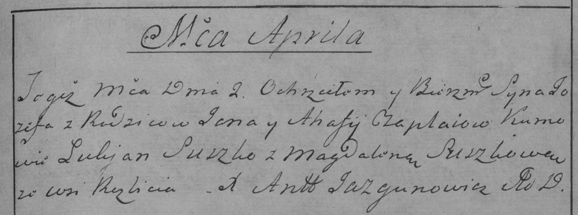

**Чапляй Иосиф Янов (Czaplay Jozef)**

2 апреля 1785 г -- крещение (РГИА 823-2-18, лист 229, №10/1785-р (коп)).

**РГИА 823-2-18:** Лист 229. **Метрическая запись №10/1785-р (коп).**

Дедиловичская Покровская церковь. 2 апреля 1785 года. Метрическая запись
о крещении.

Czaplay Jozef -- сын родителей с деревни Разлитье.

Czaplay Jan -- отец.

Czaplaiowa Ahafija -- мать.

Suszko Łukjan -- кум.

Suszkowa Magdalena - кума.

Jazgunowicz Antoni -- ксёндз.
