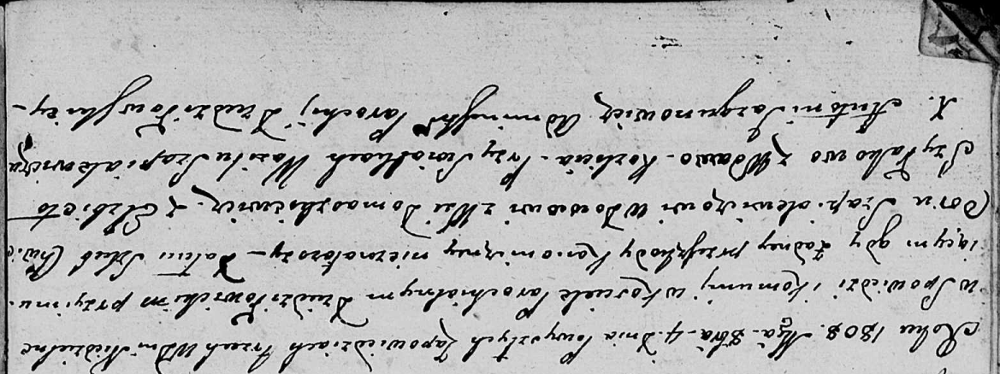

**Шапялевич (в предыдущем браке Шилак) Елисавета (Szapialewiczowa
(Szyłakowa) Elżbieta)**

4 октября 1808 г -- венчание с вдовцом Хведором Шапелевичем с деревни
Домашковичи (НИАБ 136-13-920, лист 13об, №4/1808-б (ориг)).

**НИАБ 136-13-894:** Лист 13об. **Метрическая запись №4/1808-б (ориг).**

Дедиловичская Покровская церковь. 4 октября 1808 года. Метрическая
запись о венчании.

Szapielewicz Chwiedor -- жених, вдовец, с деревни Домашковичи.

Szyłakowa Elżbieta -- невеста, вдова, с деревни Разлитье.

Szapialewicz Wasil -- свидетель.

Jazgunowicz Antoni -- ксёндз.
