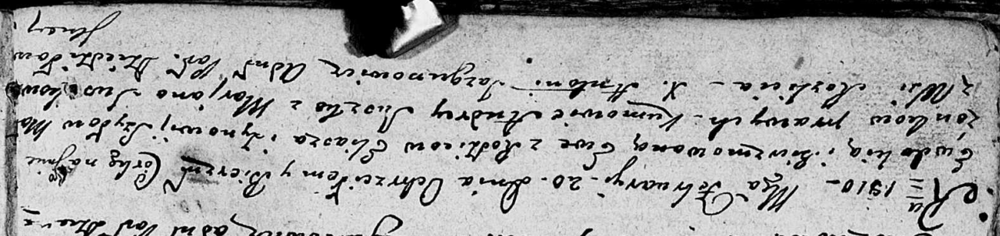

**Шило Илья (Szyło Eliasz)**

20 февраля 1810 г -- крещение дочери Евдокии Евы (НИАБ 136-13-894, лист
76об, №9/1810-р (ориг)).

**НИАБ 136-13-894:** Лист 76об. **Метрическая запись №9/1810-р (ориг).**

{width="6.496527777777778in"
height="1.5367989938757656in"}

Дедиловичская Покровская церковь. 20 февраля 1810 года. Метрическая
запись о крещении.

Szyłowna Ewdokija Ewa -- дочь родителей из деревни Разлитье.

Szyło Eliasz -- отец.

Szyłowa Zynowia -- мать.

Suszko Andrey -- кум.

Suszkowa Marjana -- кума.

Jazgunowicz Antoni -- ксёндз.
