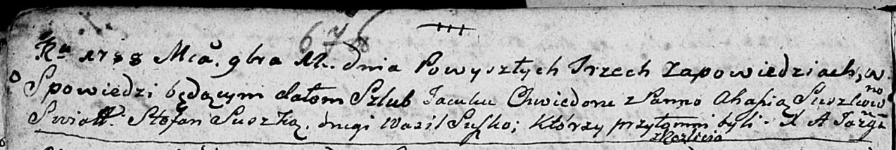

**Яцук Хведор (Jacuk Chwiedor)**

11 ноября 1788 г -- венчание с Агафией Сушко (НИАБ 136-13-894, лист
67об, №14/1788-б (ориг)).

**НИАБ 136-13-894:** Лист 67об. **Метрическая запись №14/1788-б
(ориг).**

Дедиловичская Покровская церковь. 11 ноября 1788 года. Метрическая
запись о венчании.

Jacuk Chwiedor -- жених, с деревни Разлитье.

Suszkowna Ahafia -- невеста.

Suszko Stefan -- свидетель.

Suszko Wasil -- свидетель.

Jazgunowicz Antoni -- ксёндз.
