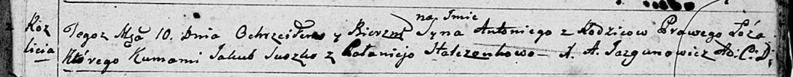

**Антон (Antoni)**

10 июля 1799 г -- крещение (НИАБ 136-13-894, лист 39, №27/1797-р
(ориг)).

**НИАБ 136-13-894:** Лист 39. **Метрическая запись №27/1799-р (ориг).**

Дедиловичская Покровская церковь. 10 июля 1799 года. Метрическая запись
о крещении.

Antoni -- сын родителей с деревни Разлитье.

Suszko Jakub -- кум.

Stralczonkowa Palanieja -- кума.

Jazgunowicz Antoni -- ксёндз.
