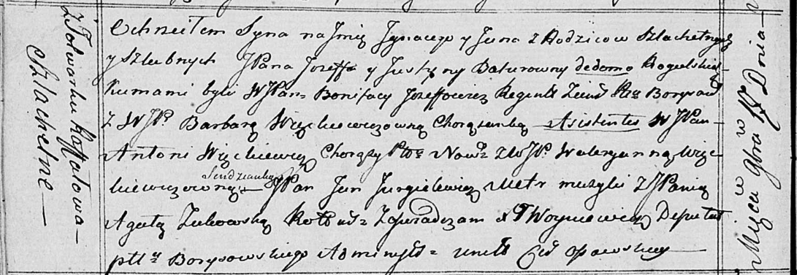

**Батура Игнацы Иосифов, шляхтич (Batura Jgnacy Jan)**

17 ноября 1818 г -- крещение (НИАБ 136-13-894, лист 99об, №39/1818-р
(ориг)).

**НИАБ 136-13-894:** Лист 99об. **Метрическая запись №39/1818-р
(ориг).**

{width="6.496527777777778in"
height="2.2435115923009623in"}

Осовская Покровская церковь. 17 ноября 1818 года. Метрическая запись о
крещении.

Batura Jgnacy Jan, JP -- сын родителей с фольварка Рафалово, шляхтич.

Batura Jozef, JP -- отец, шляхтич.

Baturowa z Ragulskich Justyna, JP -- мать, шляхтянка.

Jozefowicz Bonifacy, WJP -- кум, шляхтич. регент.

Więnckiewiczowna Barbara, WJP -- кума, шляхтянка.

Wienckiewicz Antoni, WJP -- ассистент, шляхтич.

Węnckiewiczowna Walerianna, WJP -- ассистентка, шляхтянка.

Jurgielewicz Jan, JP -- ассистент, мэтр музыки, шляхтич.

Żukowska Agata, JP -- ассистентка, шляхтянка.

Woyniewicz Tomasz -- ксёндз.
