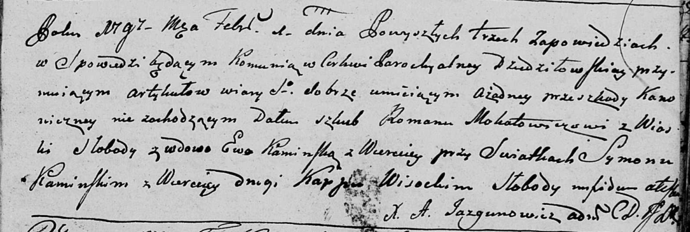

**Мокалович (в предыдущем браке Каминская) Ева (Mokałowicz (Kaminska)
Ewa)**

1 февраля 1797 г -- венчание с Романом Мокаловичем с деревни Слобода
(НИАБ 136-13-920, лист 4, №5/1797-б (ориг)).

**НИАБ 136-13-920** Лист 4. **Метрическая запись №5/1797-б (ориг).**

{width="6.496527777777778in"
height="2.1932239720034996in"}

Дедиловичская Покровская церковь. 1 февраля 1797 года. Метрическая
запись о венчании.

Mokałowicz Roman -- жених, с деревни Слобода.

Kaminska Ewa -- невеста, вдова, с деревни Веретей.

Kaminski Symon -- свидетель, с деревни Васильковка.

Wisocki Karp? -- свидетель, с деревни Слобода.

Jazgunowicz Antoni -- ксёндз.
