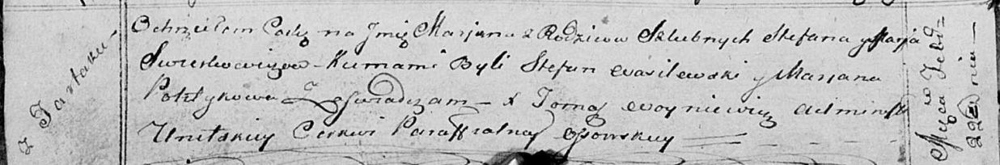

**Сверкович Стефан (Swierkowicz Stefan)**

22 февраля 1814 г -- крещение дочери Марьяны (НИАБ 136-13-894, лист
88об, №12/1814-р (ориг)).

**НИАБ 136-13-894:** Лист 88об. **Метрическая запись №12/1814-р
(ориг).**

{width="6.496527777777778in"
height="1.0721380139982502in"}

Осовская Покровская церковь. 22 февраля 1814 года. Метрическая запись о
крещении.

Swierkowiczowna Marjana -- дочь родителей с деревни Тартак.

Swierkowicz Stefan -- отец.

Swierkowiczowa Marja -- мать.

Wasilewski Stefan -- кум.

Politykowa Marjana -- кума.

Woyniewicz Tomasz -- ксёндз.
