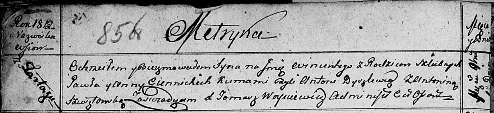

**Ценницкий Винценты Павлов (Ciennicki Wincenty)**

1 ноября 1812 г -- крещение (НИАБ 136-13-894, лист 85об, №50/1812-р
(ориг)).

**НИАБ 136-13-894:** Лист 85об. **Метрическая запись №50/1812-р
(ориг).**

Осовская Покровская церковь. 1 ноября 1812 года. Метрическая запись о
крещении.

Ciennicki Wincenty -- сын родителей с деревни Тартак.

Ciennicki Pawel -- отец.

Ciennicka Anna -- мать.

Dyszlewicz Antoni -- кум.

Szuzstowska Anonina -- кума.

Woyniewicz Tomasz -- ксёндз.
