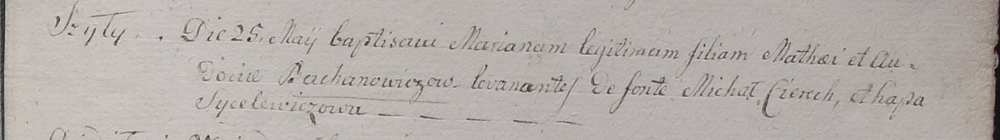

**Баханович Авдотья (Bachanowiczowa Audocia)**

25 мая 1799 г -- крещение дочери Марьяны (НИАБ 1781-27-199, лист 128,
№24/1799-р).

**НИАБ 1781-27-199:** Лист 128. **Метрическая запись №24/1799-р.**

{width="6.496527777777778in"
height="0.9152777777777777in"}

Дедиловичский костел Наисвятейшего Сердца Иисуса. 25 мая 1799 года.
Метрическая запись о крещении.

Bachanowiczowna Mariana -- сын крестьян с деревни Шилы.

Bachanowicz Mathei -- отец.

Bachanowiczowa Audocia -- мать.

Cierech Michał -- крестный отец.

Sycelewiczowa Ahapa -- крестная мать.

Linhart Hyacinthus -- ксёндз.
