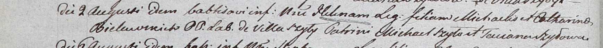

**Белявская Елена Михалова (Bielawska Helena)**

2 августа 1803 г -- крещение (НИАБ 937-4-32, лист 9об, №23/1803-р).

**НИАБ 937-4-32:** Лист 9об. **Метрическая запись №23/1803-р.**

Дедиловичский костел Наисвятейшего Сердца Иисуса. 2 августа 1803 года.
Метрическая запись о крещении.

Bielawska Helena -- дочь крестьян с деревни Шилы.

Bielawski Michael -- отец.

Bielawska Catharina -- мать.

Szyło Michael -- крестный отец.

Szyłowa Taciana -- крестная мать.

Kłoczko Antoni -- ксёндз, администратор Ошмянского костела.
