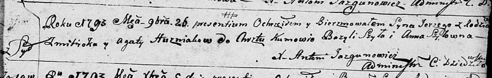
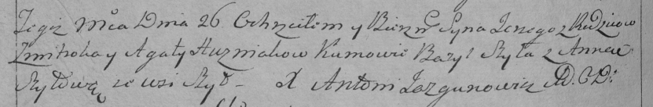

**Гузняк Змитрок (Huzniak Zmitrok)**

26 ноября 1793 г -- крещение сына Сергея (НИАБ 136-13-894, лист 21,
№82/1793-р (ориг)), (РГИА 823-2-18, лист 248об, №48/1793-р (коп)).

**НИАБ 136-13-894:** Лист 21. **Метрическая запись №82/1793-р (ориг).**

Дедиловичская Покровская церковь. 26 ноября 1793 года. Метрическая
запись о крещении.

Husziak Jerzy -- сын родителей с деревни Шилы.

Huzniak Zmitrok -- отец.

Huzniakowa Agata-- мать.

Szyło Bazyl - кум.

Szyłowna Anna - кума.

Jazgunowicz Antoni -- ксёндз.

**РГИА 823-2-18:** Лист 248об. **Метрическая запись №48/1793-р (коп).**

Дедиловичская Покровская церковь. 26 ноября 1793 года. Метрическая
запись о крещении.

Huzniak Jerzy -- сын родителей с деревни Шилы.

Huzniak Zmitrok -- отец.

Huzniakowa Agata -- мать.

Szyło Bazyl -- кум.

Szyłowa Anna -- кума.

Jazgunowicz Antoni -- ксёндз.
