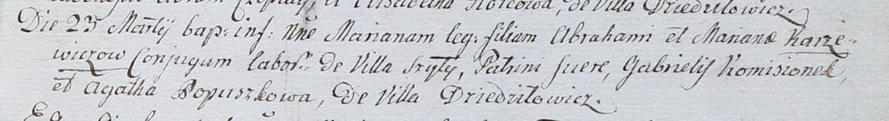

**Каржевич Марьяна (Karżewiczowa Mariana)**

23 марта 1802 г -- крещение дочери Марьяны (НИАБ 937-4-32, лист 6,
№6/1802-р).

**НИАБ 937-4-32:** Лист 6. **Метрическая запись №6/1802-р.**

{width="6.496527777777778in"
height="0.89375in"}

Дедиловичский костел Наисвятейшего Сердца Иисуса. 23 марта 1802 года.
Метрическая запись о крещении.

Karzewiczowna Mariana -- дочь крестьян с деревни Шилы.

Karzewicz Abraham -- отец.

Karzewiczowa Mariana -- мать.

Kamosionek Gabriel -- крестный отец, с деревни Дедиловичи?.

Popuszkowa Agatha -- крестная мать, с деревни Дедиловичи.

Linhart Hyacinthus -- ксёндз.
