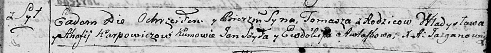
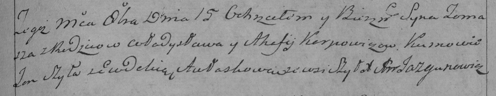

**Карпович Хома Владыславов (Karpowicz Tomasz)**

15 октября 1794 г -- крещение (НИАБ 136-13-894, лист 23, №45/1794-р
(ориг)), (РГИА 823-2-18, лист 251, №32/1794-р (коп)).

**НИАБ 136-13-894:** Лист 23. **Метрическая запись №45/1794-р (ориг).**

Дедиловичская Покровская церковь. 15 октября 1794 года. Метрическая
запись о крещении.

Karpowicz Tomasz -- сын родителей с деревни Шилы.

Karpowicz Władysław -- отец.

Karpowiczowa Ahafija -- мать.

Shyło Jan - кум.

Awłaskowa Ewdokija - кума.

Jazgunowicz Antoni -- ксёндз.

**РГИА 823-2-18:** Лист 251. **Метрическая запись №32/1794-р (коп).**

Дедиловичская Покровская церковь. 15 октября 1794 года. Метрическая
запись о крещении.

Karpowicz Tomasz -- сын родителей с деревни Шилы.

Karpowicz Władysław -- отец.

Karpowiczowa Ahafija -- мать.

Szyła Jan -- кум.

Aułaskowa Ewdokia -- кума.

Jazgunowicz Antoni -- ксёндз.
