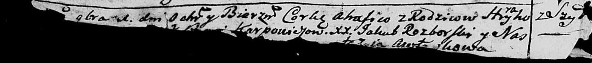

**Карпович Агафия Грыгорова (Karpowiczowna Ahafia)**

1 ноября 1787 г -- крещение (НИАБ 136-13-894, лист 2об, №49/1787-р
(ориг)).

**НИАБ 136-13-894:** Лист 2об. **Метрическая запись №49/1787-р (ориг).**

Дедиловичская Покровская церковь. 1 ноября 1787 года. Метрическая запись
о крещении.

Karpowiczowna Ahafia - дочь родителей с деревни Шилы.

Karpowicz Hryhor -- отец.

Karpowiczowa ? -- мать.

Rozborski Jakub - кум.

Awtuszkowa Nastazia - кума.
