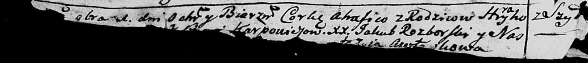
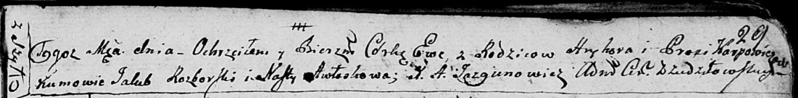

**Карпович Грыгор (Karpowicz Hryhor)**

1 ноября 1787 г -- крещение дочери Агафии (НИАБ 136-13-894, лист 2об,
№49/1787-р (ориг)).

25 марта 1796 г -- крещение дочери Евы (НИАБ 136-13-894, лист 29,
№38/1796-р (ориг)).

**НИАБ 136-13-894:** Лист 2об. **Метрическая запись №49/1787-р (ориг).**

Дедиловичская Покровская церковь. 1 ноября 1787 года. Метрическая запись
о крещении.

Karpowiczowna Ahafia - дочь родителей с деревни Шилы.

Karpowicz Hryhor -- отец.

Karpowiczowa \[Prosia\] -- мать.

Rozborski Jakub - кум.

Awtuszkowa Nastazia - кума.

Лист 29. **Метрическая запись №38/1796-р (ориг).**

Дедиловичская Покровская церковь. 25 марта 1796 года. Метрическая запись
о крещении.

Karpowiczowna Ewa -- дочь родителей с деревни Шилы.

Karpowicz Hryhor -- отец.

Karpowiczowa Prosia -- мать.

Rozborski Jakub - кум.

Awłaskowa Nasta - кума.

Jazgunowicz Antoni -- ксёндз.
