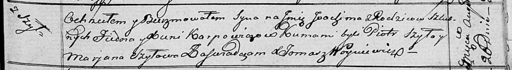

**Карпович Яким Фёдоров (Karpowicz Joakim)**

26 августа 1816 г -- крещение (НИАБ 136-13-894, лист 94, №26/1816-р
(ориг)).

**НИАБ 136-13-894:** Лист 94. **Метрическая запись №26/1816-р (ориг).**

{width="6.496527777777778in"
height="0.891101268591426in"}

Осовская Покровская церковь. 26 августа 1816 года. Метрическая запись о
крещении.

Karpowicz Joakim -- сын родителей с деревни Шилы.

Karpowicz Fiedor -- отец.

Karpowiczowa Xienia -- мать.

Szyło Piotr -- кум.

Szyłowa Marjana -- кума.

Woyniewicz Tomasz -- ксёндз.
