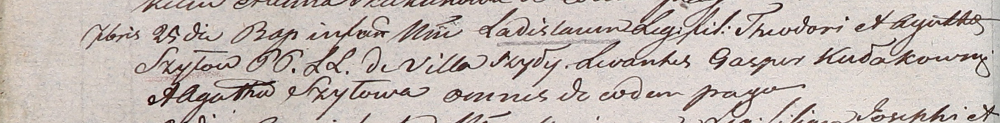

**Кулаковский Гаспер (Kułakowski Gasper)**

25 сентября 1804 года -- крестный отец Владислава, сына Хведора и Гапы
Шил с деревни Шилы (НИАБ 937-4-32, лист 10об, №22/1804-р).

**НИАБ 937-4-32:** Лист 10об. **Метрическая запись №22/1804-р.**

Дедиловичский костел Наисвятейшего Сердца Иисуса. 25 сентября 1804 года.
Метрическая запись о крещении.

Szyło Ładisław -- сын родителей с деревни Шилы.

Szyło Theodor -- отец.

Szyłowa Agatha -- мать.

Kułakowski Gasper -- крестный отец, с деревни Шилы.

Szyłowa Agatha -- крестная мать, с деревни Шилы.

Galinowski Joann -- ксёндз, комендант Дедиловичского костела.
