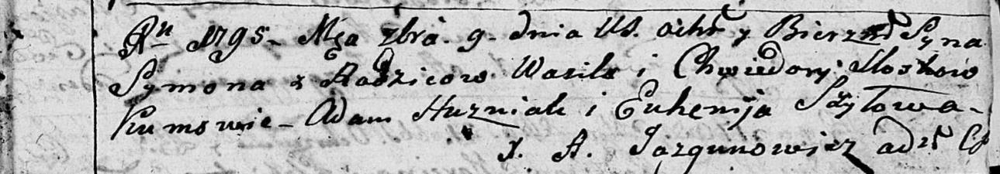
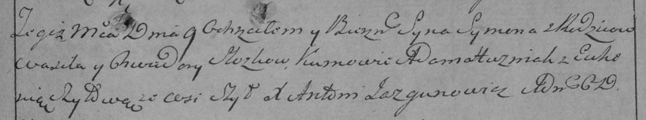

**Моск Хведора (Moskowa, Sloskowa Chwiedora)**

9 сентября 1795 г -- крещение сына Сымона (НИАБ 136-13-894, лист 25,
№34/1795-р (ориг)), (РГИА 823-2-18, лист 253, №27/1795-р (коп)).

**НИАБ 136-13-894:** Лист 25. **Метрическая запись №34/1795-р (ориг).**

Дедиловичская Покровская церковь. 9 сентября 1795 года. Метрическая
запись о крещении.

Mosk \[Sloska\] Symon -- сын \[родителей с деревни Шилы\].

Mosk \[Sloska\] Wasil -- отец.

Moskowa \[Sloskowa\] Chwiedora -- мать.

Huzniak Adam - кум.

Szyłowa Euhenija - кума.

Jazgunowicz Antoni -- ксёндз.

**РГИА 823-2-18:** Лист 253. **Метрическая запись №27/1795-р (коп).**

Дедиловичская Покровская церковь. 9 сентября 1795 года. Метрическая
запись о крещении.

\[Mosk\] Slozka Symon -- сын родителей с деревни Шилы.

\[Mosk\] Slozka Wasil -- отец.

\[Moskowa\] Slozkowa Chwiedora -- мать.

Huzniak Adam -- кум.

Szyłowa Euhenia -- кума.

Jazgunowicz Antoni -- ксёндз.
