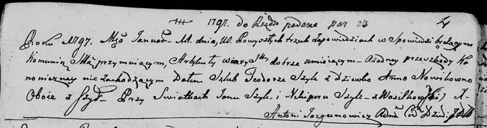

**Шило (Новик) Анна (Szyłowa Anna z Nowikow)**

11 января 1797 года -- венчание с Тодором Шило с деревни Шилы (НИАБ
136-13-920, лист 4, №1/1797-б (ориг)).

**НИАБ 136-13-920:** Лист Лист 4. **Метрическая запись №1/1797-б
(ориг).**

{width="6.496527777777778in"
height="1.7151531058617673in"}

Дедиловичская Покровская церковь. 11 января 1797 года. Метрическая
запись о венчании.

Szyło Teodor -- жених, с деревни Шилы.

Nowikowna Anna -- невеста, девка, с деревни Шилы.

Szyło Jan -- свидетель.

Szyło Nikipor -- свидетель, с деревни Васильковка.

Jazgunowicz Antoni -- ксёндз.
