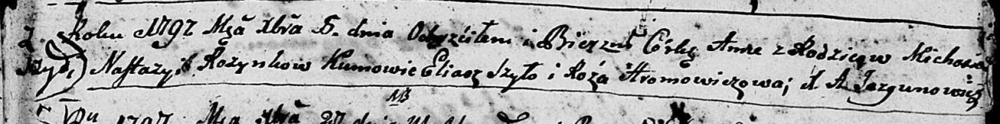
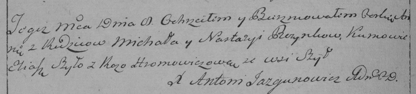

**Розынко Михась (Rozynko Michaś)**

8 декабря 1797 г -- крещение дочери Анны (НИАБ 136-13-894, лист 35,
№68/1797-р (ориг)), (РГИА 823-2-18, лист 261об, №49/1797-р (коп)).

**НИАБ 136-13-894:** Лист 35. **Метрическая запись №68/1797-р (ориг).**

Дедиловичская Покровская церковь. 8 декабря 1797 года. Метрическая
запись о крещении.

Rozynkowna Anna -- дочь родителей с деревни Шилы.

Rozynko Michaś -- отец.

Rozynkowa Nastazyia -- мать.

Szyło Eliasz - кум.

Hromowiczowa Róza - кума.

Jazgunowicz Antoni -- ксёндз.

**РГИА 823-2-18:** Лист 261об. **Метрическая запись №49/1797-р (коп).**

Дедиловичская Покровская церковь. 8 декабря 1797 года. Метрическая
запись о крещении.

Rozynkowna Anna -- дочь родителей с деревни Шилы.

Rozynka Michał -- отец.

Rozynkowa Nastazya -- мать.

Szyło Eliasz -- кум.

Hromowiczowa Roza -- кума.

Jazgunowicz Antoni -- ксёндз.
