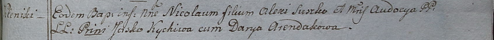

**Сушко Николай Алексеев (Suszko Nikołay)**

9 ноября 1798 г -- крещение (НИАБ 1781-27-199, лист 123, №16/1798-р).

**НИАБ 1781-27-199:** Лист 123. **Метрическая запись №16/1798-р.**

Дедиловичский костел Наисвятейшего Сердца Иисуса. 9 ноября 1798 года.
Метрическая запись о крещении.

Suszko Nikołay -- сын крестьян с деревни Шилы.

Suszko Alexi -- отец.

Suszkowa Audacya -- мать.

Kychiw Jasko -- крестный отец.

Arendakowa Darya - крестная мать.

Linhart Hyacinthus -- ксёндз.
