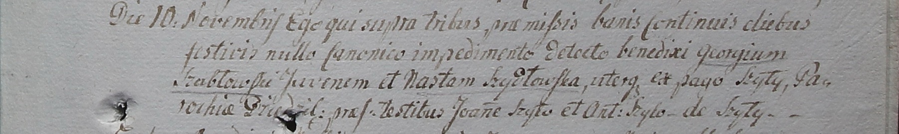

**Шабловская (Шидловская) Наста (Szabłowska Nasta z Szidłowskich)**

10 ноября 1799 г -- венчание с молодым Георгием Шабловским с деревни
Шилы (НИАБ 1781-27-199, лист 130, №12/1799-б).

**НИАБ 1781-27-199:** Лист 130. **Метрическая запись №12/1799-б.**

{width="6.496527777777778in"
height="0.9701388888888889in"}

Дедиловичский костел Наисвятейшего Сердца Иисуса. 10 ноября 1799 года.
Метрическая запись о венчании.

Szabłowski Georgi -- жених, молодой, с деревни Шилы.

Szydłowska Nasta -- невеста, с деревни Шилы, парохии Дедиловичской.

Szyło Joann -- свидетель.

Szyło Antoni -- свидетель, с деревни Шилы.

Linhart Hyacinthus -- ксёндз.
