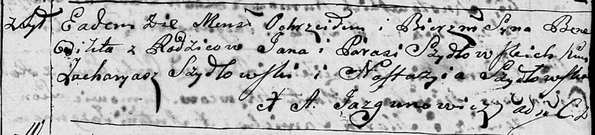
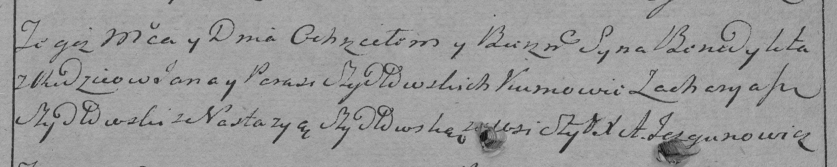

**Шидловский Ян (Szydłowski Jan)**

28 октября 1795 г -- крещение сына Бенедикта (НИАБ 136-13-894, лист 26,
№49/1795-р (ориг)), (РГИА 823-2-18, лист 253об, №37/1795-р (коп)).

**НИАБ 136-13-894:** Лист 26. **Метрическая запись №49/1795-р (ориг).**

Дедиловичская Покровская церковь. 28 октября 1795 года. Метрическая
запись о крещении.

Szydłowski Benedikt -- сын родителей с деревни Шилы.

Szydłowski Jan -- отец.

Szydłowska Parasia -- мать.

Szydłowski Zacharyasz - кум.

Szydłowska Nastazyia - кума.

Jazgunowicz Antoni -- ксёндз.

**РГИА 823-2-18:** Лист 253об. **Метрическая запись №37/1795-р (коп).**

Дедиловичская Покровская церковь. 28 октября 1795 года. Метрическая
запись о крещении.

Szydłowski Benedykt -- сын родителей с деревни Шилы.

Szydłowski Jan -- отец.

Szydłowska Parasia -- мать.

Szydłowski Zacharyasz -- кум.

Szydłowska Nastazya -- кума.

Jazgunowicz Antoni -- ксёндз.
