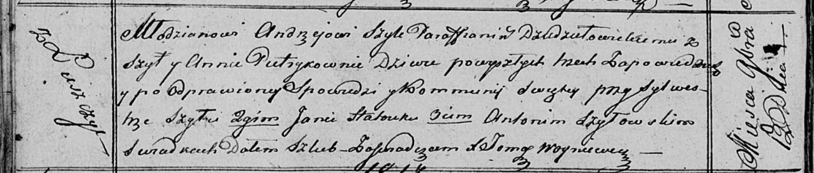

**Шило Андрей (Szyło Andrzey)**

12 ноября 1816 г -- венчание с девкой Анной Петрик с деревни Лустичи
(НИАБ 136-13-920, лист 23об, №14/1816-б (ориг)).

**НИАБ 136-13-894:** Лист 23об. **Метрическая запись №14/1816-б
(ориг).**

Осовская Покровская церковь. 12 ноября 1816 года. Запись о венчании.

Szyło Andrzey -- жених, молодой, парафии Дедиловичской католической, с
деревни Шилы.

Pietrykowna Anna -- невеста, девка, с деревни Лустичи.

Szyło Sylwester -- свидетель.

Hatruk Jan -- свидетель.

Szyłowski Antoni -- свидетель.

Woyniewicz Tomasz -- ксёндз.
