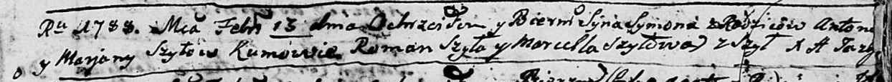

**Шило Сымон Антонов (Szyło Symon)**

13 февраля 1788 г -- крещение (НИАБ 136-13-894, лист 4, №20/1788-р
(ориг)).

**НИАБ 136-13-894:** Лист 4. **Метрическая запись №20/1788-р (ориг).**

Дедиловичская Покровская церковь. 13 февраля 1788 года. Метрическая
запись о крещении.

Szyło Symon -- сын родителей с деревни Шилы.

Szyło Antoni -- отец.

Szyłowa Marjana -- мать.

Szyło Roman - кум.

Szyłowa Marcella - кума.

Jazgunowicz Antoniusz -- ксёндз.
