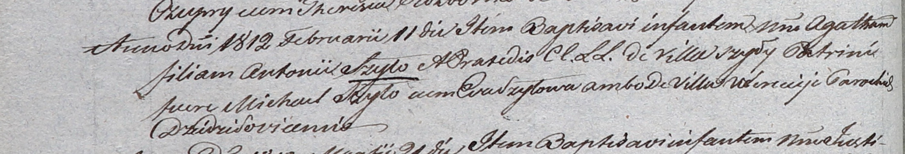

**Шило Агата Антонова (Szyłowna Agatha)**

11 февраля 1812 г -- крещение (НИАБ 937-4-32, лист 24об, №11/1811-р).

**НИАБ 937-4-32:** Лист 24об. **Метрическая запись №11/1812-р.**

Дедиловичский костел Наисвятейшего Сердца Иисуса. 11 февраля 1812 года.
Метрическая запись о крещении.

Szyłowna Agatha -- дочь родителей с деревни Шилы.

Szyło Antoni -- отец.

Szyłowa Praxeda -- мать.

Szyło Michael -- крестный отец, с деревни Веретей.

Szyłowa Eva -- крестная мать, с деревни Веретей.

Kłoczko Antonius -- ксёндз, администратор Омнишевский.
