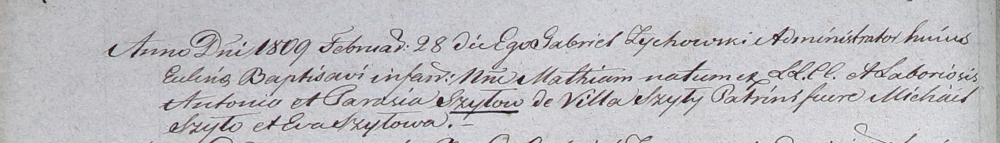

**Шило Матей Антонов (Szyło Mathias)**

28 февраля 1809 г -- крещение (НИАБ 937-4-32, лист 19об, №10/1809-р).

**НИАБ 937-4-32:** Лист 19об. **Метрическая запись №10/1809-р.**

Дедиловичский костел Наисвятейшего Сердца Иисуса. 28 февраля 1809 года.
Метрическая запись о крещении.

Szyło Mathias -- сын крестьян с деревни Шилы.

Szyło Antoni -- отец.

Szyłowa Parasia -- мать.

Szyło Michael -- крестный отец.

Szyłowa Eva -- крестная мать.

Zychowski Gabriel -- ксёндз.
