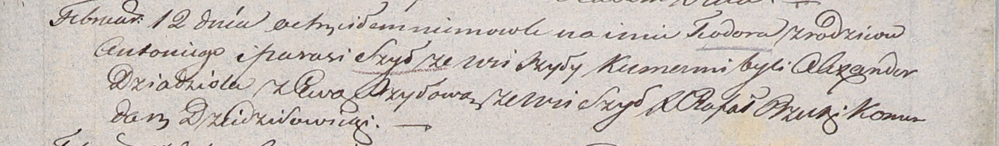

**Шило Теодор Антонов (Szyło Teodor)**

12 февраля 1806 г -- крещение (НИАБ 937-4-32, лист 13, №3/1806-р).

**НИАБ 937-4-32:** Лист 13. **Метрическая запись №3/1806-р.**

Дедиловичский костел Наисвятейшего Сердца Иисуса. 12 февраля 1806 года.
Метрическая запись о крещении.

Szyło Teodor -- сын родителей с деревни Шилы.

Szyło Antoni -- отец.

Szyłowa Parasia -- мать.

Dziadziola Alexander -- крестный отец.

Szyłowa Ewa -- крестная мать, с деревни Шилы.

Rzucki Rafal -- ксёндз, комендант Дедиловичский.
