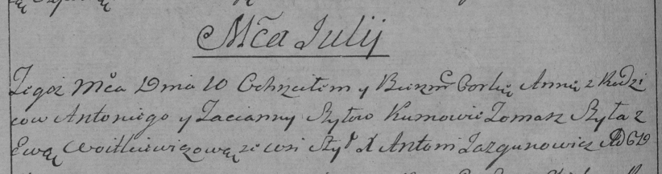

**Шило Анна Антосева (Szyłowna Anna)**

10 июля 1792 г -- крещение (НИАБ 136-13-894, лист 16об, №40/1792-р
(ориг)), (РГИА 823-2-18, лист 244, №17/1792-р (коп)).

Лист 16об. **Метрическая запись №40/1792-р (ориг).**

{width="6.496527777777778in"
height="1.1633267716535434in"}

Дедиловичская Покровская церковь. 10 июля 1792 года. Метрическая запись
о крещении.

Szyłowna Anna -- дочь родителей с деревни Шилы.

Szyło Antoni -- отец.

Szyłowa Taciana -- мать.

Szyło Tomasz - кум.

Woytkiewiczowa Ewa - кума.

Jazgunowicz Antoni -- ксёндз.

**РГИА 823-2-18:** Лист 244об. **Метрическая запись №17/1792-р (коп).**

{width="6.496527777777778in"
height="1.7152777777777777in"}

Дедиловичская Покровская церковь. 10 июля 1792 года. Метрическая запись
о крещении.

Szyłowna Anna -- дочь родителей с деревни Шилы.

Szyło Antoni -- отец.

Szyłowa Tacianna -- мать.

Szyła Tomasz -- кум.

Wojtkiewiczowa Ewa -- кума.

Jazgunowicz Antoni -- ксёндз.
