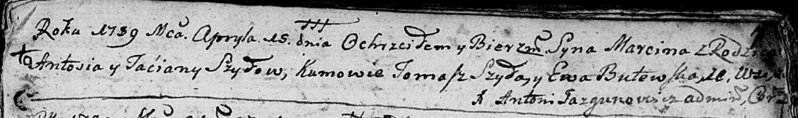
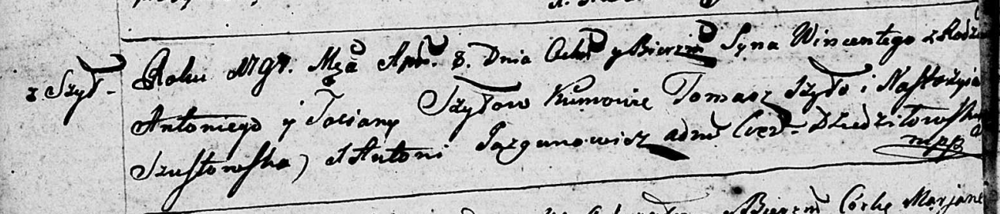
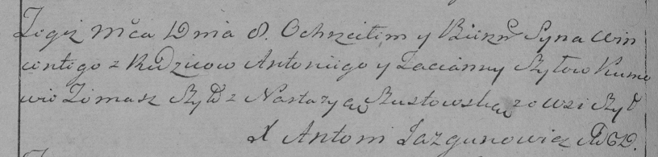
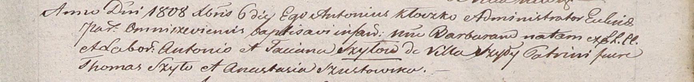

**Шило Антось (Szyło Antoś, Antoni)**

15 апреля 1789 г -- крещение сына Марцина (НИАБ 136-13-894, лист 7,
№24/1789-р (ориг)), (РГИА 823-2-18, лист 238, №10/1789-р (коп)).

29 июня 1790 г -- крещение дочери Елисаветы (НИАБ 136-13-894, лист 10,
№37/1790-р (ориг)).

29 июня 1790 г -- крещение дочери Елисаветы (НИАБ 136-13-894, лист 10,
№37/1790-р (ориг)), (РГИА 823-2-18, лист 238, №10/1789-р (коп)).

10 июля 1792 г -- крещение дочери Анны (НИАБ 136-13-894, лист 16об,
№40/1792-р (ориг)), (РГИА 823-2-18, лист 244, №17/1792-р (коп)).

8 апреля 1797 г -- крещение сына Винцентыя (НИАБ 136-13-894, лист 32об,
№21/1797-р (ориг)), (РГИА 823-2-18, лист 259об, №18/1797-р (коп)).

30 июля 1799 г -- крещение сына Томаша (НИАБ 1781-27-199, лист 128,
№33/1799-р).

22 мая 1802 г -- крещение сына Игнатия (НИАБ 937-4-32, лист 6об,
№12/1802-р).

6 декабря 1808 г -- крещение дочери Барбары (НИАБ 937-4-32, лист 19,
№27/1808-р).

**НИАБ 136-13-894:** Лист 7. **Метрическая запись №24/1789-р (ориг).**

Дедиловичская Покровская церковь. 15 апреля 1789 года. Метрическая
запись о крещении.

Szyło Marcin -- сын.

Szyło Antoś -- отец.

Szyłowa Taćiana -- мать.

Szyło Tomasz - кум.

Butowska Ewa - кума.

Jazgunowicz Antoni -- ксёндз.

**РГИА 823-2-18:** Лист 238. **Метрическая запись №10/1789-р (коп).**

Дедиловичская Покровская церковь. 15 апреля 1789 года. Метрическая
запись о крещении.

Szyło Marcin -- сын родителей с деревни Шилы.

Szyło Antoś -- отец.

Szyłowa Tacianna -- мать.

Szyło Tomasz -- кум.

Butowska Ewa - кума.

Jazgunowicz Antoni -- ксёндз.

**НИАБ 136-13-894:** Лист 10. **Метрическая запись №37/1790-р (ориг).**

Дедиловичская Покровская церковь. 29 июня 1790 года. Метрическая запись
о крещении.

Szyłowna Elżbieta -- дочь родителей с деревни Шилы.

Szyło Antoś -- отец.

Szyłowa Taciana -- мать.

Szyło Tomasz - кум.

Woytkiewiczowa Ewa - кума.

Jazgunowicz Antoni -- ксёндз.

**НИАБ 136-13-894:** Лист 16об. **Метрическая запись №40/1792-р
(ориг).**

Дедиловичская Покровская церковь. 10 июля 1792 года. Метрическая запись
о крещении.

Szyłowna Anna -- дочь родителей с деревни Шилы.

Szyło Antoni -- отец.

Szyłowa Taciana -- мать.

Szyło Tomasz - кум.

Woytkiewiczowa Ewa - кума.

Jazgunowicz Antoni -- ксёндз.

**РГИА 823-2-18:** Лист 244об. **Метрическая запись №17/1792-р (коп).**

Дедиловичская Покровская церковь. 10 июля 1792 года. Метрическая запись
о крещении.

Szyłowna Anna -- дочь родителей с деревни Шилы.

Szyło Antoni -- отец.

Szyłowa Tacianna -- мать.

Szyła Tomasz -- кум.

Wojtkiewiczowa Ewa -- кума.

Jazgunowicz Antoni -- ксёндз.

**НИАБ 136-13-894:** Лист 32об. **Метрическая запись №21/1797-р
(ориг).**

Дедиловичская Покровская церковь. 8 апреля 1797 года. Метрическая запись
о крещении.

Szyło Wincenty -- сын родителей с деревни Шилы.

Szyło Antoni -- отец.

Szyłowa Taciana -- мать.

Szyło Tomasz - кум.

Szustowska Nastazyia - кума.

Jazgunowicz Antoni -- ксёндз.

**РГИА 823-2-18:** Лист 259об. **Метрическая запись №18/1797-р (коп).**

Дедиловичская Покровская церковь. 8 апреля 1797 года. Метрическая запись
о крещении.

Szyło Wincenty -- сын родителей с деревни Шилы.

Szyło Antoni -- отец.

Szyłowa Tacianna -- мать.

Szyło Tomasz -- кум.

Szustowska Nastazya -- кума.

Jazgunowicz Antoni -- ксёндз.

**НИАБ 1781-27-191:** Лист 128. **Метрическая запись №33/1799-р.**

Дедиловичский костел Наисвятейшего Сердца Иисуса. 30 июля 1799 года.
Метрическая запись о крещении.

Szyło Thomasz -- сын крестьян с деревни Шилы.

Szyło Antoni -- отец.

Szyłowa Taciana -- мать.

Szyłak Thomasz -- крестный отец.

Szustowska Anastasia -- крестная мать.

Linhart Hyacinthus -- ксёндз.

**НИАБ 937-4-32:** Лист 6об. **Метрическая запись №12/1802-р.**

Дедиловичский костел Наисвятейшего Сердца Иисуса. 22 мая 1802 года.
Метрическая запись о крещении.

Szyłło Jgnati -- сын крестьян с деревни Шилы.

Szyłło Antoni -- отец.

Szyłłowa Taciana -- мать.

Szyłło Thomas -- крестный отец.

Szustowska Anastasia -- крестная мать, с деревни Васильковка.

Linhart Hyacinthus -- ксёндз.

**НИАБ 937-4-32:** Лист 19. **Метрическая запись №27/1808-р.**

Дедиловичский костел Наисвятейшего Сердца Иисуса. 6 декабря 1808 года.
Метрическая запись о крещении.

Szyłowna Barbara -- дочь крестьян с деревни Шилы.

Szyło Antonio -- отец.

Szyłowna Tacciana -- мать.

Szyło Thomas -- крестный отец.

Szustowska Anastasia -- крестная мать.

Kłoczko Antonius -- ксёндз, администратор Ошмянский.
