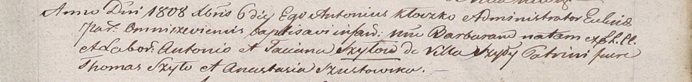

**Шило Барбара Антосева (Szyłowna Barbara)**

6 декабря 1808 г -- крещение (НИАБ 937-4-32, лист 19, №27/1808-р).

**НИАБ 937-4-32:** Лист 19. **Метрическая запись №27/1808-р.**

Дедиловичский костел Наисвятейшего Сердца Иисуса. 6 декабря 1808 года.
Метрическая запись о крещении.

Szyłowna Barbara -- дочь крестьян с деревни Шилы.

Szyło Antonio -- отец.

Szyłowna Tacciana -- мать.

Szyło Thomas -- крестный отец.

Szustowska Anastasia -- крестная мать.

Kłoczko Antonius -- ксёндз, администратор Ошмянский.
