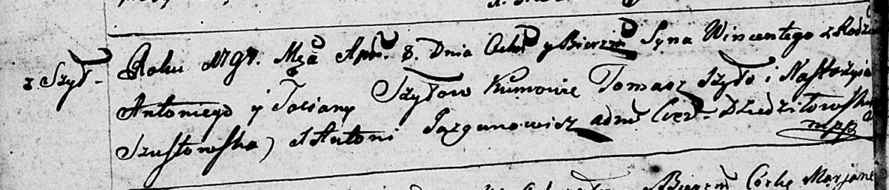
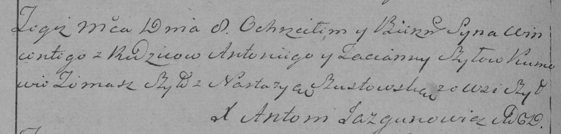

**Шило Винценты Антосев (Szyło Wincenty)**

8 апреля 1797 г -- крещение (НИАБ 136-13-894, лист 32об, №21/1797-р
(ориг)), (РГИА 823-2-18, лист 259об, №18/1797-р (коп)).

**НИАБ 136-13-894:** Лист 32об. **Метрическая запись №21/1797-р
(ориг).**

Дедиловичская Покровская церковь. 8 апреля 1797 года. Метрическая запись
о крещении.

Szyło Wincenty -- сын родителей с деревни Шилы.

Szyło Antoni -- отец.

Szyłowa Taciana -- мать.

Szyło Tomasz - кум.

Szustowska Nastazyia - кума.

Jazgunowicz Antoni -- ксёндз.

**РГИА 823-2-18:** Лист 259об. **Метрическая запись №18/1797-р (коп).**

Дедиловичская Покровская церковь. 8 апреля 1797 года. Метрическая запись
о крещении.

Szyło Wincenty -- сын родителей с деревни Шилы.

Szyło Antoni -- отец.

Szyłowa Tacianna -- мать.

Szyło Tomasz -- кум.

Szustowska Nastazya -- кума.

Jazgunowicz Antoni -- ксёндз.
