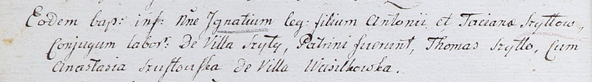

**Шило Игнатий Антосев (Szyło Jgnati)**

22 мая 1802 г -- крещение (НИАБ 937-4-32, лист 6об, №12/1802-р).

**НИАБ 937-4-32:** Лист 6об. **Метрическая запись №12/1802-р.**

{width="6.496527777777778in"
height="0.9090277777777778in"}

Дедиловичский костел Наисвятейшего Сердца Иисуса. 22 мая 1802 года.
Метрическая запись о крещении.

Szyłło Jgnati -- сын крестьян с деревни Шилы.

Szyłło Antoni -- отец.

Szyłłowa Taciana -- мать.

Szyłło Thomas -- крестный отец.

Szustowska Anastasia -- крестная мать, с деревни Васильковка.

Linhart Hyacinthus -- ксёндз.
