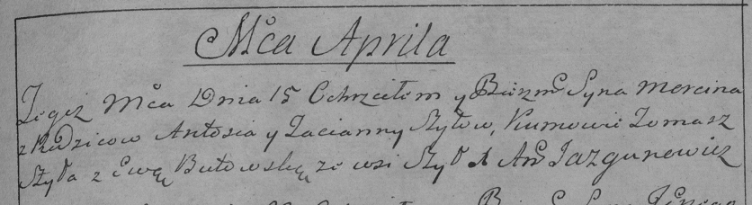

**Шило Марцин Антосев (Szyło Marcin)**

15 апреля 1789 г -- крещение (НИАБ 136-13-894, лист 7, №24/1789-р
(ориг)), (РГИА 823-2-18, лист 238, №10/1789-р (коп)).

Лист 7. **Метрическая запись №24/1789-р (ориг).**

{width="6.496527777777778in"
height="0.9688801399825022in"}

Дедиловичская Покровская церковь. 15 апреля 1789 года. Метрическая
запись о крещении.

Szyło Marcin -- сын.

Szyło Antoś -- отец.

Szyłowa Taćiana -- мать.

Szyło Tomasz - кум.

Butowska Ewa - кума.

Jazgunowicz Antoni -- ксёндз.

**РГИА 823-2-18:** Лист 238. **Метрическая запись №10/1789-р (коп).**

{width="6.496527777777778in"
height="1.7715277777777778in"}

Дедиловичская Покровская церковь. 15 апреля 1789 года. Метрическая
запись о крещении.

Szyło Marcin -- сын родителей с деревни Шилы.

Szyło Antoś -- отец.

Szyłowa Tacianna -- мать.

Szyło Tomasz -- кум.

Butowska Ewa - кума.

Jazgunowicz Antoni -- ксёндз.
