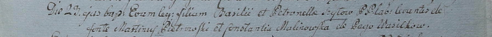

**Шило Базыль (Szyło Bazili)**

23 октября 1799 г -- крещение дочери Евы (НИАБ 1781-27-199, лист 129,
№46/1799-р).

**НИАБ 1781-27-199:** Лист 129. **Метрическая запись №46/1799-р.**

Дедиловичский костел Наисвятейшего Сердца Иисуса. 23 октября 1799 года.
Метрическая запись о крещении.

Szyłowna Ewa -- дочь крестьян с деревни Васильковка.

Szyło Basili -- отец.

Szyłowa Petronella -- мать.

Pietrowski Martinusz -- крестный отец.

Malinowska Constantia -- крестная мать.

Linhart Hyacinthus -- ксёндз.
