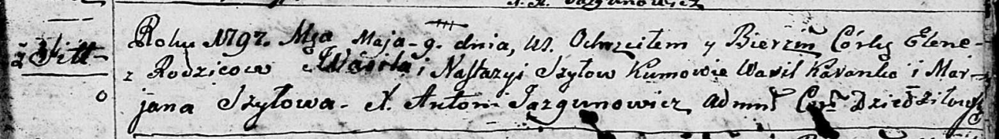

**Шило Елена Василева (Szyłowna Elena)**

9 мая 1797 г -- крещение (НИАБ 136-13-894, лист 33, №29/1797-р (ориг)).

**НИАБ 136-13-894:** Лист 33. **Метрическая запись №29/1797-р (ориг).**

{width="6.496527777777778in"
height="0.9078641732283464in"}

Дедиловичская Покровская церковь. 9 мая 1797 года. Метрическая запись о
крещении.

Szyłowna Elena -- дочь родителей с деревни Шилы.

Szyło Wasil -- отец.

Szyłowa Nastazyia -- мать.

Karanko Wasil - кум.

Szyłowa Marjana - кума.

Jazgunowicz Antoni -- ксёндз.
