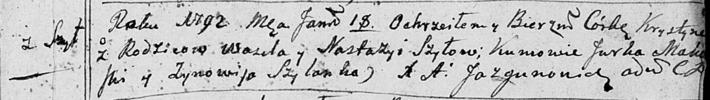

**Шило Хрыстына Василева (Szyłowna Krystyna)**

18 января 1792 г -- крещение (НИАБ 136-13-894, лист 15, №2/1792-р
(ориг)).

**НИАБ 136-13-894:** Лист 15. **Метрическая запись №2/1792-р (ориг).**

{width="6.496527777777778in"
height="0.9199332895888014in"}

Дедиловичская Покровская церковь. 18 января 1792 года. Метрическая
запись о крещении.

Szyłowna Krystyna -- дочь родителей с деревни Шилы.

Szyło Wasil -- отец.

Szyłowa Nastazyja -- мать.

Makowski Jurka -- кум.

Szyłanka Zynowija - кума.

Jazgunowicz Antoni -- ксёндз.
